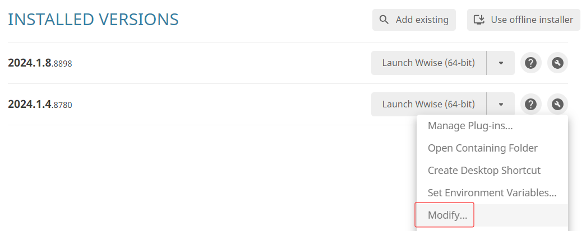
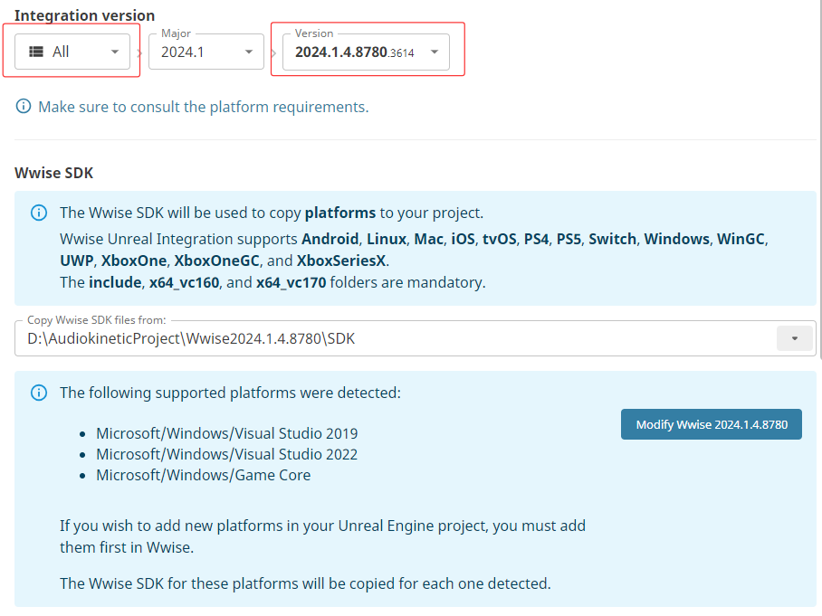
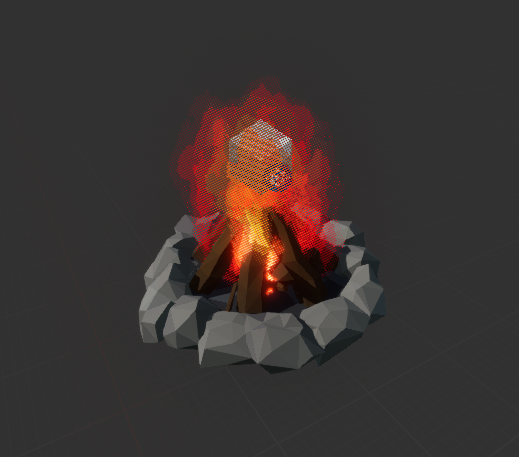
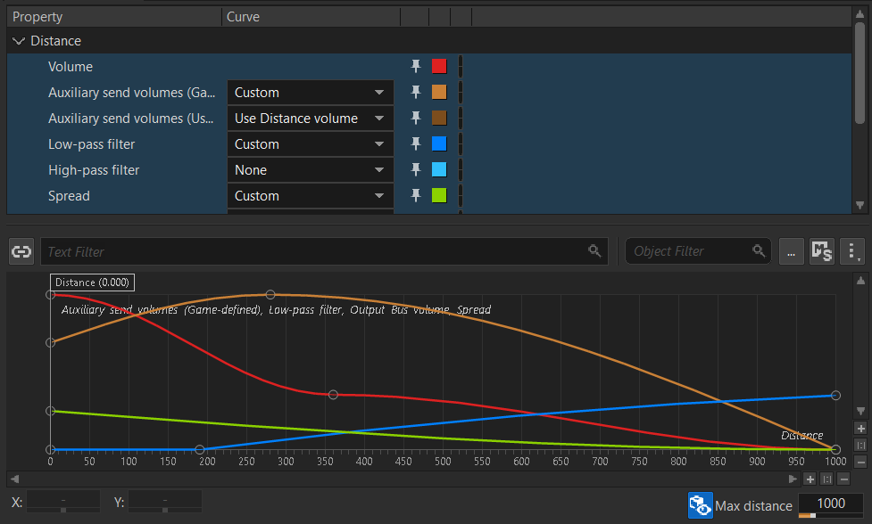
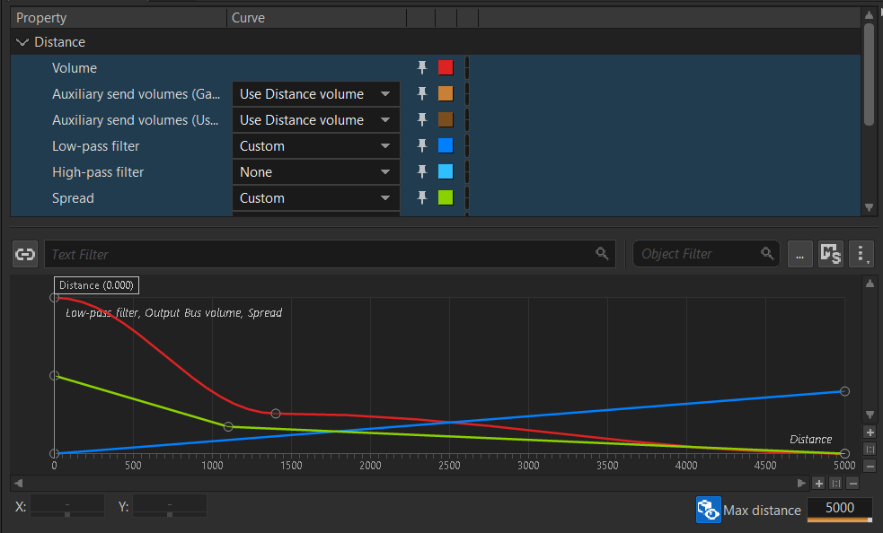
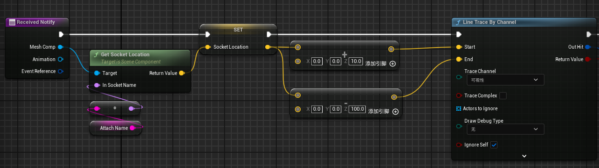
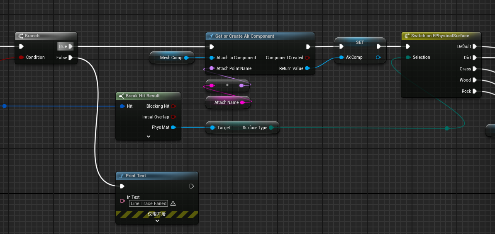
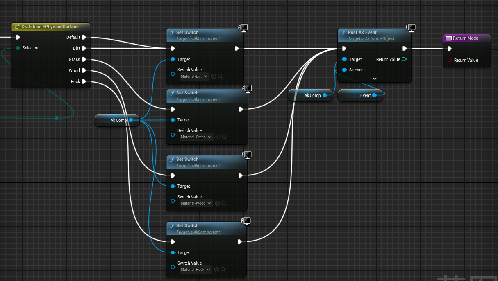

# 2025 - 2026 学年春季学期《游戏音频设计》期末作品说明

## 0 软件安装

由于先前已经安装过 Wwise 与 UE 5.4.4（下文将使用该版本进行开发），因此下文将跳过部分软件的安装过程。

### 0.1 修改 Wwise 版本

在先前的《基础实践》系列课程中，我已经安装过了 2024.1.4 版本（下文也将使用该版本进行开发），但是由于我们需要与 UE 进行对接，因此还需要修改该版本，为其安装 SDK，并指定开发平台为 Microsoft (Windows)。

### 0.2 接入 UE 工程

#### 0.2.1 Wwise 工程设置

在创建好 UE 工程之后，在 Audiokinetic Launcher 左侧的 Unreal Engine 条目中可以找到刚刚创建的 UE 工程，然后点击右侧的 `Integrate Wwise In Project` 按钮即可。

需要注意的是，最新的 Wwise 版本并不支持 UE（报错提示直译过来好像是这样），我们需要将 `Intergration version` 从 `Latest` 切换到 `All` 来查找我们刚刚修改过的版本，如果我们先前没有为该版本添加 SDK 的话此处将会报错。

我们可以在该页下方创建工程文件，也可事先创建好工程文件，并指定该文件的路径。

在 Wwise 工程中，我们需要勾选项目设置中的 `SoundBanks - SoundBanks Settings - Enable Auto-Defined SoundBank`，以此来自动为 `Event` 创建 `SoundBanks`。

我们还需要先在 `SoundBanks` 视图中点击 `Generated All` 来生成 `InitBank`。

#### 0.2.2 UE

在 UE 工程的项目设置中，我们需要将 `WWise - Intergration Settings - Installation - Root Output Path` 设置为 Wwise 项目设置中的 `GeneratedSoundBanks` 所在路径；并将 `Initialization` 中的 `Init Bank` 设置为上文生成的 `InitBank`。

### 0.3 Wwise -> UE 工作流

1. 在 Wwise 中导入声音资产，调整各类参数后创建 `Event`；
2. 将 `Layouts` 切换至 `SoundBank` 后，点击 `SoundBank Manager - Generate All` 来生成 `SoundBank`；

>由于上文中我们已经为 UE 指定了 `GeneratedSoundBanks` 所在路径，UE 将会识别到这些 `SoundBank`，但是我们还需要将他们转化成 `UAsset`。

3. 在 UE 中打开 `Wwise Browser` 窗口，点击右上角的箭头图标，即 `Reconcile`，即可将 `SoundBank` 转化为 `UAsset`；
4. 后续如果还需要对该音频资产进行修改，或者需要导入其他声音资产，只需要重复上述流程即可。

## 1 Campfire - 物件 3D Object

### 1.1 导入声音资产

在导入声音资产之前，我们还需要先创建 `Work Unit`，在多人协作中，不同的开发人员可以单独修改各自的 `Work Unit`，便于进行版本控制。我们需要为篝火声音资产创建一个 `Work Unit`。

### 1.2 配置 `Container`

- `Loop`

对于篝火的声音基底来说，我们只需要开启循环播放 `Loop` 即可。

- `Crack` 和 `Sizzle`

这两种声音资产显然不应当持续播放，而是应当每间隔一段时间再播放，同时每次播放的声音与时间间隔不应当完全一致，以免影响听感。因此我们使用 `Random Container` 来随机播放，同时需要修改 `Random Container - Mode - PlayMode` 为 `Continuous` 来持续播放；勾选 `Loop - Enable` 与 `Transition - Enable`，并修改 `Transition Type` 为 `Trigger rate` 来设置播放的间隔时间，我们也可以点击 `Duration` 左侧的小方块来设置间隔时间的随机范围，此处设置为 [3,8] 。

由于我们需要同时播放上述的三种资产，因此我们需要为他们创建一个父类的 `Blend Container`。

### 1.3 UE Campfire BP 制作

在完成了 0.3 节中所写的工作流后，我们还需要在场景中播放篝火的声音资产。

首先我在虚幻商城里找了一个免费的篝火模型，以及一个燃烧效果的 `Niagara`，而后将其放入一个 BP 中，并添加一个 `Ak Component`，最后在事件图表中，为 `Ak Component` 创建一个 `Post Ak Event` 节点来选择我们制作好的篝火 `Event`，同时将其连接到 `Event Begin` 以此来在游戏开始时自动播放。

## 2 基础环境声 Ambience

对于空间中的环境声基底，我们需要将其设置为 `Loop`，同时勾选 `Loop Infinite`，以此来让其无限循环。

环境声的音频空间化将在后文讲述。

## 3 空间音频 Spatial Audio with Room and Portal

### 3.1 `Ak Spatial Audio Volume`

我们需要为室外与室内房间各设置一个 `Ak Spatial Audio Volume`，同时保证室内优先级高于室外。

室外的 `Ak Spatial Audio Volume` 用于播放环境声，室内用于添加混响效果。

- 室外

由于处于室外，因此我们需要取消勾选 `Surface Properties - Enable Surface`，并将传输损耗 `Transmission Loss` 设置为 0，还需要取消勾选 `Enable Component - Enable Surface Reflector Set`。

为了播放环境声，我们需要将 `Ak Audio Event` 设置为前文环境声的 `Event`，同时勾选 `Auto Post` 来自动播放环境声。

- 室内

为了让玩家进入室内是使用室内的声音设置，我们需要调整 `Late Reverb - Priority` 和 `Room - Priority`，使其高于室内。

### 3.2 `Ak Portal`

`Ak Portal`需要被放置在两个 `Ak Spatial Audio Volume` 的交界处，同时需要注意两者的连接方向。

### 3.3 音频空间化

#### 3.3.1 篝火

篝火属于点声源，因此玩家听到的声音变化与篝火的位置相关，因此我们需要在 Wwise 中，将篝火的 `Blend Container` 的 `Positioning - Listener Relative Routing - 3D Spatialization` 设置为 `Position`，并勾选 `Diffraction and Transmission`。

#### 3.3.2 基础环境声

环境声资产是一个多通道的声音资产，而不是点声源，因此我们需要将上述选项设置为 `Position + Orientation`，并勾选 `Diffraction and Transmission`。

### 3.4 衰减

由于声音的响度等参数会随着玩家距离发声体的远近而发生变化，因此，我们还需要对篝火和环境声在 Wwise 的 `Positioning - Attenuation` 中设置两者的衰减曲线。两者曲线形状大致相同，但环境声的 `Max Distance` 需要更大一些。

### 3.5 混响

#### 3.5.1 Wwise 设置

我们在《音响系统》与《影视声音设计》课程中曾学习过，我们需要将音频送入 Aux Bus 辅助通路来添加混响效果，在 Wwise 中，我们可以在 `Master-Mixer Hierarchy` 层级下添加 `Auxiliary Bus`，并在 `Effects` 面板中右键添加 `RoomVerb` 混响效果。

同时我们还需要勾选 `Positioning - Listener Relative Routing - Enable` 来开启音频空间化。

但是我们并不是在 Wwise 中将声音送入 Aux Bus，而是在 UE 中，因此我们需要启用声音资产的 `Routing - Game-Defined Auxiliary Sends`。

#### 3.5.2 UE 设置

Aux Bus 同样属于声音资产，同样需要使用 0.3 节中的方法完成导入。而后我们可以在室内的 `Ak Spatial Audio Volume` 中取消勾选 `Late Reverb - Auto Assign Aux Bus`，而后自行设置 `Aux Bus` 为我们刚刚导入的混响总线。

### 3.6 Audio Listener

第三人称游戏与第一人称不同，玩家听到的声音朝向并不是所操控角色的旋转角度所决定的，而是摄像机的朝向所决定的，因此我们需要在 `Pawn` 类中重写 `Audio Listener Override` 逻辑，将其 `Rotation` 设置为摄像机的旋转。

## 4 角色脚步 Character Foley Footstep

### 4.1 Wwise

脚步声可以按照动作、鞋型、脚下的材质分类。此处我们将材质作为最底层，使用 `Random Container` 来随机播放，而鞋型和材质的切换则需要使用到 `Switch Container` 与 `Game Sync - Switches`。

我们需要在该层级下创建 `Material` 和 `ShoeType` 两个 `SwitchGroup`，而后在 `Material` 下新建四种材质对应的 `Switch` ，最后在 `Switch Container` 中指定每种 `Container` 所对应的 `Switch Group` 和 `Switch` 即可。

### 4.2 UE

#### 4.2.1 指定材质分类

我们可以在项目设置中的 `Engine - Physics - Physical Surface` 中添加四种材质种类，而后在创建 `Physical Material` 时指定对应的 `Surface Type`，最后创建 `Material`，并指定 `Physical Material` 即可。

#### 4.2.2 Notify

我们需要在角色奔跑动画中通过 Notify 的形式来播放脚步声，但是 Wwise 为我们直接提供了 `Ak Event Notify` 来直接播放脚步声的 `Event`，而不需要在事件图表里监听 Notify，因此我们只需要在左右脚落地的位置添加 `Ak Event Notify` 即可。

#### 4.2.3 射线检测

添加了 `Ak Event Notify` 后，我们还需要修改其原有逻辑，通过射线检测的方式来检测下方的材质的 `Phyical Material`，以此来通过切换 `Game Sync - Switch` 的方式切换不同材质对应的脚步声。

- 首先要在角色的脚部的 `Socket` 位置向下进行射线检测；

- 同时在脚部 `Socket` 创建 `Ak Component`，而后通过检测到的 `Phyical Material` 切换 `Switch`，最后播放脚步声。

---

- 一个小问题：角色身上衣服的声音我想应该也是和脚步声一样通过 Notify 来播放，可是 Notify 所使用的 `Attach Socket` 应该设置在哪里比较好呢？毕竟角色的手臂会和腰部发出摩擦声，角色跑步时腿部的布料应该也会有声音。

>我猜应该用腰部的 `Socket`